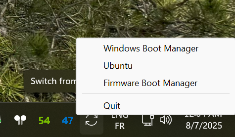

# Win2Linux

The software is still in alpha.

Small script in Go that allows you to reboot Windows to another operating system registered in the UEFI database.

Inspiriation from "Restart To" gnome extension (https://github.com/tiagoporsch/restartto)